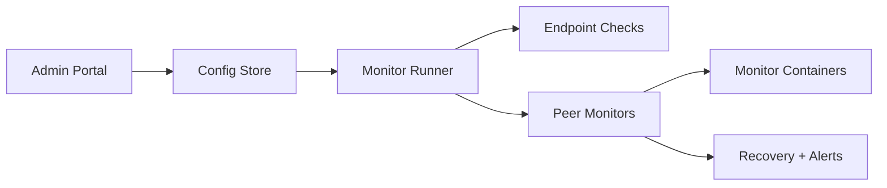

# Async Service Monitor

`async-service-monitor` is a Python service for monitoring endpoints, services, and peer monitor containers from a config file, a browser-based admin portal, or both.

## At A Glance

| Area | What It Does |
| --- | --- |
| Endpoint Monitoring | HTTP, DNS, auth-aware checks, content validation |
| Admin Portal | Dashboard, dedicated monitor pages, add-monitor flow |
| Cluster Monitoring | Peer health, failover, recovery owner selection |
| Container Ops | Start, stop, restart, and create monitor containers |
| Telemetry Storage | Optional 2-hour MySQL retention for monitor events, node health, and config snapshots |

## Visual Flow



## Main Screens

### Dashboard

- Endpoint monitors listed with simple health dots
- Outcome summary cards for healthy, unhealthy, disabled, and total
- Sidebar navigation to each configured monitor

### Dedicated Monitor Pages

- One page per monitor
- Edit URL or host
- Update auth details
- Save and trigger an immediate re-check

### Containers

- Configure peer monitor entries
- Enable or disable monitor containers
- Start, stop, or restart containers
- Add new monitor containers live

### Using The Service

- Built-in guide page in the portal
- Operator-focused explanations for monitoring, editing, and scaling

## Local Run

```powershell
py -3 -m venv .venv
.venv\Scripts\Activate.ps1
pip install -e .
py -3 -m service_monitor --config config.yaml
```

Open [http://localhost:8000](http://localhost:8000).

## Docker Run

```powershell
docker build -t async-service-monitor .
docker run --rm -p 8000:8000 -v ${PWD}/config.yaml:/app/config.yaml async-service-monitor
```

## Clustered Compose

```powershell
docker compose up --build
```

## Key Files

- `src/service_monitor/admin.py`
- `src/service_monitor/runner.py`
- `src/service_monitor/cluster.py`
- `src/service_monitor/config.py`
- `src/service_monitor/config_store.py`
- `src/service_monitor/web/index.html`
- `src/service_monitor/web/app.css`
- `src/service_monitor/web/app.js`

## Notes

- Monitor config edits are written back to the YAML file.
- Updated monitors now re-run immediately after save.
- Creating monitor containers live requires Docker access and an image that already exists or can be pulled.
- Cluster recovery requires Docker Engine access from the monitoring runtime.
