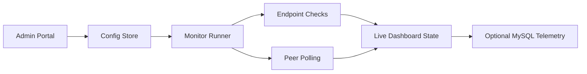
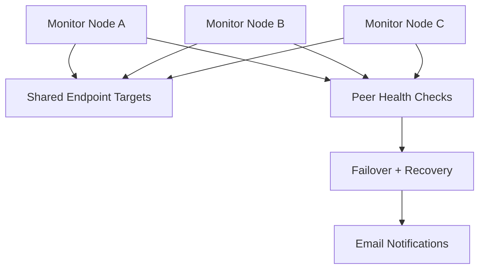
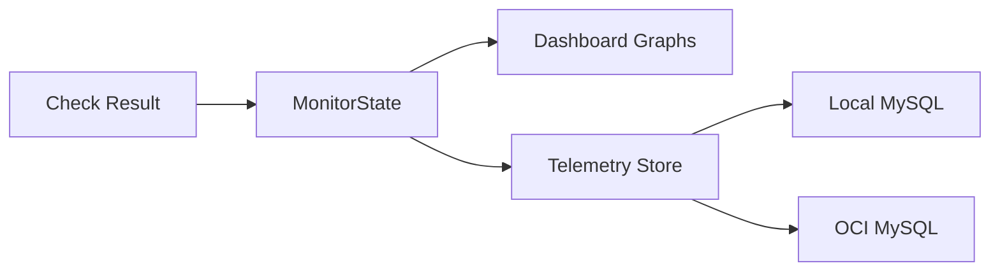

# Async Service Monitor

`async-service-monitor` is a Python monitoring platform for endpoint health, peer monitor coordination, Docker-based recovery, live administration, and short-retention telemetry storage.

## At A Glance

| Area | What It Does |
| --- | --- |
| Endpoint Monitoring | HTTP, DNS, and auth-aware checks with content validation |
| Admin Portal | Dashboard, dedicated monitor pages, FAQ, profile, and service configuration |
| Cluster Monitoring | Peer health polling, failover ownership, and recovery decisions |
| Container Ops | Start, stop, restart, and create monitor containers live |
| Access Control | Read-only, read-write, and admin portal accounts |
| Telemetry Storage | Optional 2-hour MySQL retention for monitor results, node health, and config snapshots |

## Architecture

### Core Flow



### Cluster Behavior



### Telemetry Retention



## Main Portal Areas

### FAQ

- Visual service-flow diagrams
- Answers for monitoring, scaling, auth, and telemetry storage

### Dashboard

- Endpoint health dots
- Live availability graphs
- Node-health graphs
- Last-fired timestamps and latest result summaries

### Monitor Pages

- One page per monitor
- Edit targets, timing, validation, and auth settings
- Enable, disable, and delete checks

### Containers

- Manage peer monitor definitions
- Control monitor containers
- Add new monitor containers live

### Administration

- User and role management
- Service configuration for telemetry and OCI auth scaffolding
- Self-service local MySQL provisioning for telemetry storage

## Telemetry Storage

Telemetry storage is optional and can retain up to 2 hours of:

- endpoint monitor results
- node heartbeat history
- configuration snapshots

You can point telemetry at:

1. A local MySQL instance
2. An OCI-hosted MySQL instance

If you select local MySQL in the admin portal, you can also enable self-service provisioning. In that mode the service will attempt to start a local MySQL Docker container for you using `mysql:8.4`, then persist the generated connection details back into the config.

Assumption:
This self-service local setup expects Docker Engine to be available on the machine running the admin portal.

## Running Locally

```powershell
py -3 -m venv .venv
.venv\Scripts\Activate.ps1
pip install -e .
py -3 -m service_monitor --config config.yaml
```

Open [http://localhost:8000](http://localhost:8000).

On a brand-new config with no portal users yet, the first visitor will be taken through a required admin onboarding flow before the rest of the application becomes available. The service no longer relies on a built-in default admin account.

## Encrypting Sensitive Config Values

The service now supports encrypting sensitive values inside `config.yaml` before you commit or push it to Git. The same file can then be copied to another machine and decrypted at runtime as long as that machine has the same `ASM_CONFIG_PASSPHRASE` environment variable set.

Sensitive fields include:

- portal usernames and passwords
- email usernames and passwords
- telemetry usernames and passwords
- check auth usernames, passwords, bearer tokens, and header values

Generate a strong passphrase:

PowerShell:

```powershell
py -3 -m service_monitor --generate-config-passphrase
```

WSL / bash:

```bash
python -m service_monitor --generate-config-passphrase
```

Set the passphrase in your shell before encrypting or running the app:

PowerShell:

```powershell
$env:ASM_CONFIG_PASSPHRASE = "replace-with-your-passphrase"
```

WSL / bash:

```bash
export ASM_CONFIG_PASSPHRASE="replace-with-your-passphrase"
```

Encrypt an existing config file before committing it:

PowerShell:

```powershell
py -3 -m service_monitor --encrypt-config --config config.yaml
```

WSL / bash:

```bash
python -m service_monitor --encrypt-config --config config.yaml
```

Important:

- Keep `ASM_CONFIG_PASSPHRASE` out of Git and store it in your secret manager, password vault, CI secret store, or deployment environment.
- Any machine that runs the app with an encrypted config file must have the same `ASM_CONFIG_PASSPHRASE` value available.
- Existing plaintext configs still load for migration purposes, but saving config changes with real secrets now requires `ASM_CONFIG_PASSPHRASE` so secrets are not written back in plain text.

## Running With Docker

PowerShell:

```powershell
docker build -t async-service-monitor .
docker run --rm -p 8000:8000 -v ${PWD}/config.yaml:/app/config.yaml async-service-monitor
```

WSL / bash:

```bash
docker build -t async-service-monitor .
docker run --rm -p 8000:8000 -v "$(pwd)/config.yaml:/app/config.yaml" async-service-monitor
```

If `config.yaml` contains encrypted values, pass the config passphrase into the container too.

PowerShell:

```powershell
docker run --rm -p 8000:8000 -e ASM_CONFIG_PASSPHRASE=${env:ASM_CONFIG_PASSPHRASE} -v ${PWD}/config.yaml:/app/config.yaml async-service-monitor
```

WSL / bash:

```bash
docker run --rm -p 8000:8000 -e ASM_CONFIG_PASSPHRASE="$ASM_CONFIG_PASSPHRASE" -v "$(pwd)/config.yaml:/app/config.yaml" async-service-monitor
```

## Offline-Friendly Deployment

This repo now includes an offline build and deployment path, but there is one important distinction:

- The repo is now structured for air-gapped deployment.
- The actual offline assets still need to be prepared once from a connected machine.

Offline assets live under:

- `offline/wheelhouse/`
- `offline/images/`

### What Must Be Prepared Before Going Offline

From a connected machine, prepare:

1. Python wheels for the app and every dependency
2. Docker image tar files for:
   - `python:3.12-slim`
   - `async-service-monitor:offline`
   - `mysql:8.4`
   - `axllent/mailpit:latest`

### Prepare Offline Assets

```powershell
.\scripts\prepare-offline-assets.ps1
```

That script will:

- build a local wheelhouse into `offline/wheelhouse`
- pull the required base/support images
- build the offline app image with [Dockerfile.offline](C:\Users\pipsq\OneDrive\Documents\async-service-monitor\Dockerfile.offline)
- export image tar files into `offline/images`

### Verify Offline Assets

```powershell
.\scripts\verify-offline-assets.ps1
```

### Build The Offline Image

Once `offline/wheelhouse` has been populated, the image can be rebuilt without internet access as long as the base image is already loaded locally:

```powershell
docker build -f Dockerfile.offline -t async-service-monitor:offline .
```

### Load Prebuilt Offline Images In An Air-Gapped Environment

```powershell
.\scripts\load-offline-assets.ps1
```

### Run Offline

PowerShell:

```powershell
docker run --rm -p 8000:8000 -v ${PWD}/config.yaml:/app/config.yaml async-service-monitor:offline
```

WSL / bash:

```bash
docker run --rm -p 8000:8000 -v "$(pwd)/config.yaml:/app/config.yaml" async-service-monitor:offline
```

### Run Offline With Compose

```powershell
docker compose -f docker-compose.offline.yml up
```

### Air-Gap Notes

- Local self-provisioned MySQL still expects `mysql:8.4` to already be loaded into Docker.
- Local self-provisioned Mailpit still expects `axllent/mailpit:latest` to already be loaded into Docker.
- If you plan to use OCI MySQL or external email providers in an offline environment, those endpoints still need network reachability from that environment.

## Clustered Compose

```powershell
docker compose up --build
```

## Key Files

- `src/service_monitor/admin.py`
- `src/service_monitor/auth.py`
- `src/service_monitor/runner.py`
- `src/service_monitor/cluster.py`
- `src/service_monitor/config.py`
- `src/service_monitor/config_store.py`
- `src/service_monitor/telemetry.py`
- `src/service_monitor/web/index.html`
- `src/service_monitor/web/app.css`
- `src/service_monitor/web/app.js`
- `Dockerfile.offline`
- `docker-compose.offline.yml`
- `scripts/prepare-offline-assets.ps1`
- `scripts/load-offline-assets.ps1`
- `scripts/verify-offline-assets.ps1`

## Notes

- Monitor config edits are written back to the YAML file.
- Updated monitors re-run immediately after save.
- The portal uses session-based login today and includes OCI auth scaffolding for future integration.
- Local MySQL self-provisioning uses Docker and is intended to reduce manual setup when telemetry storage is enabled.
- Offline deployment support now exists, but the required wheelhouse and image tar files must still be generated once on a connected machine before moving into a disconnected environment.
